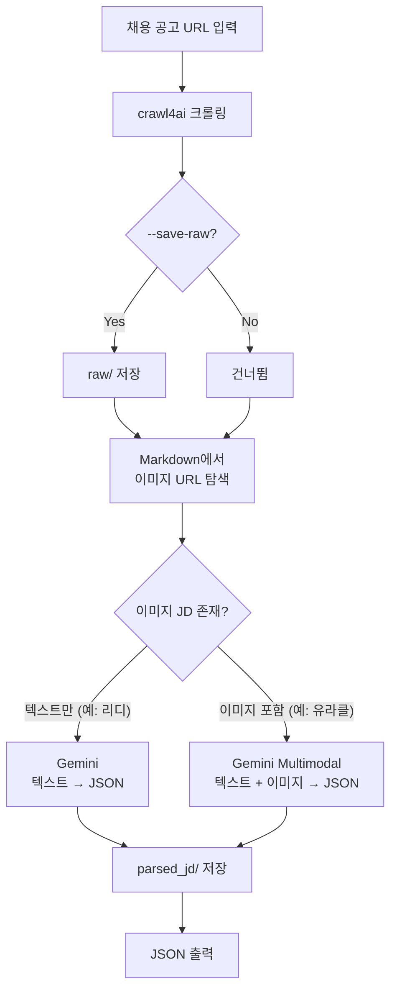
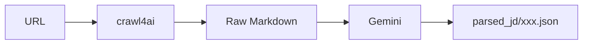
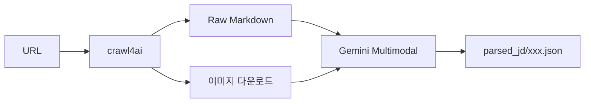

# Slayer — JD Scraper & Parser

[2026-02-25 기준]
채용 공고 URL을 입력하면, AI(Gemini)를 통해 **정형화된 JSON**으로 추출해주는 파이프라인입니다.
현재 **잡코리아(JobKorea)**를 주력으로 지원하며, 텍스트와 이미지가 혼합된 공고도 처리 가능합니다.

## 빠른 시작

```powershell
# 기본 사용 (JSON 출력 + parsed_jd/ 자동 저장)
python -m slayer "https://www.jobkorea.co.kr/Recruit/GI_Read/48589768?Oem_Code=C1"

# raw 데이터도 함께 저장 (원문 Markdown + 이미지)
python -m slayer "https://www.jobkorea.co.kr/Recruit/GI_Read/48589768?Oem_Code=C1" --save-raw

# 파일로 저장
python -m slayer "URL" -o output.json
```

---

## 파라미터

| 파라미터         | 타입      | 기본값  | 설명                                                |
| ---------------- | --------- | ------- | --------------------------------------------------- |
| `URL`            | 필수      | -       | 지원 플랫폼(잡코리아 등) 채용 공고 URL              |
| `--save-raw`     | 플래그    | `False` | crawl4ai raw markdown + 원본 이미지를 `raw/`에 저장 |
| `-o`, `--output` | 파일 경로 | `None`  | JSON 결과를 파일에 저장 (미지정 시 stdout 출력)     |

---

## 전체 처리 흐름



---

## 지원 플랫폼 현황

| 플랫폼                | LLM 추출 (JSON) | 멀티모달 (이미지) | 상태                                       |
| --------------------- | --------------- | ----------------- | ------------------------------------------ |
| **잡코리아**          | ✅ 지원         | ✅ 지원           | 주력 지원 중                               |
| **사람인, 원티드 등** | ⚠️ 부분 지원    | ❌ 미지원         | 텍스트 기반 Markdown 추출 위주 (개선 예정) |

---

## 저장되는 파일 구조

```
Slayer/
├── parsed_jd/                              ← 최종 결과물 (항상 자동 저장)
│   ├── jobkorea_48589768.json                  텍스트 전용 공고 결과
│   └── jobkorea_48499321.json                  텍스트 + 이미지 통합 결과
│
├── raw/                                    ← 원본 입력 (--save-raw 시에만 저장)
│   ├── jobkorea_48499321_raw.md                crawl4ai가 변환한 Markdown 원본
│   └── jobkorea_48499321_images/               이미지 공고인 경우 원본 이미지 파일들
│
└── slayer/                                 ← 파이썬 소스 코드
```

---

## 데이터 흐름

### 1. 텍스트 전용 JD

이미지가 없는 일반적인 공고. Gemini를 1회 호출하여 JSON으로 정제합니다.



### 2. 이미지 포함 JD (멀티모달)

공고 상세 내용이 이미지로 된 경우. 텍스트와 이미지를 한 번의 **Gemini Multimodal** 호출로 처리합니다.



---

## 모드 자동 전환 로직 (Decision Logic)

Slayer는 별도의 설정 없이도 공고 본문에 이미지가 포함되어 있는지 자동으로 감지하여 최적의 모드로 전환합니다:

1.  **이미지 추출**: `crawl4ai`가 생성한 Markdown에서 모든 이미지 링크(``)를 추출합니다.
2.  **유효성 검사 (Filtering)**:
    - **확장자 확인**: `.jpg`, `.jpeg`, `.png`, `.gif`, `.webp` 확장자를 가진 파일만 대상으로 합니다.
    - **노이즈 제거**: 광고 서버(`ads.jobkorea`), 로고 서버(`imgs.jobkorea`), 트래킹 픽셀, 사내 시스템 관련 이미지 패턴(`Logo`, `Brand`, `career`, `wp-content`) 등을 필터링하여 제외합니다.
3.  **최종 판정**:
    - 필터링 후 **유효한 이미지가 1개 이상**이면 → **Gemini Multimodal 모드** (텍스트 + 이미지 동시 전달)
    - 유효한 이미지가 **0개**이면 → **단순 LLM 모드** (텍스트 전용 전달)

---

## Hallucination 방지 및 검증

| 계층            | 방법                                   | 적용 대상          |
| --------------- | -------------------------------------- | ------------------ |
| **프롬프트**    | "원본 텍스트를 그대로 유지" 지시       | 공통               |
| **모델 설정**   | `temperature=0.0`, `top_p=0.1`         | 공통               |
| **스키마 강제** | `response_schema` (JSON Mode) 사용     | 공통               |
| **사후 검증**   | `verify_extraction()` — 원본 대조 체크 | **텍스트 전용 JD** |
| **수동 대조**   | `raw/` 이미지와 최종 JSON 비교         | 이미지 포함 JD     |

> [!NOTE]
> 이미지 포함 JD는 이미지 내의 텍스트가 Markdown 원본에 존재하지 않으므로, `verify_extraction`에 의한 사후 검증은 건너뛰고 멀티모달 추출 결과를 그대로 사용합니다.

---

## 출력 JSON 스키마 (예시)

```json
{
  "company": "회사명",
  "title": "공고 제목",
  "overview": {
    "employment_type": "정규직",
    "experience": "경력(2년이상)",
    "education": "대졸이상",
    "location": "서울 강남구 ...",
    "deadline": "2026.03.30(월)",
    "work_hours": "09:00~18:00"
  },
  "responsibilities": ["담당 업무 리스트"],
  "requirements": {
    "required": ["필수 요건"],
    "preferred": ["우대 사항"]
  },
  "skills": ["기술 스택"],
  "url": "원본 소스 URL",
  "platform": "jobkorea"
}
```

---

## 모듈 주요 역할

| 모듈            | 역할                                                       |
| --------------- | ---------------------------------------------------------- |
| `cli.py`        | 사용자 명령(CLI) 접수 및 결과 출력                         |
| `scraper.py`    | crawl4ai 구동, 원문 및 결과 파일 저장 관리                 |
| `registry.py`   | URL에 따라 적절한 파서(JobKorea, Saramin 등) 선택          |
| `parsers/`      | 플랫폼별 특화된 추출 로직 (현재 JobKorea가 가장 고도화됨)  |
| `llm_client.py` | **Gemini API 호출 및 Multimodal 처리**, Hallucination 검증 |

---

## Python 코드에서 사용하기 (라이브러리 방식)

```python
from slayer.scraper import scrape_jd

# 동기식 호출
jd = scrape_jd("잡코리아_URL", save_raw=True)
print(jd["company"])
print(jd["skills"])
```
