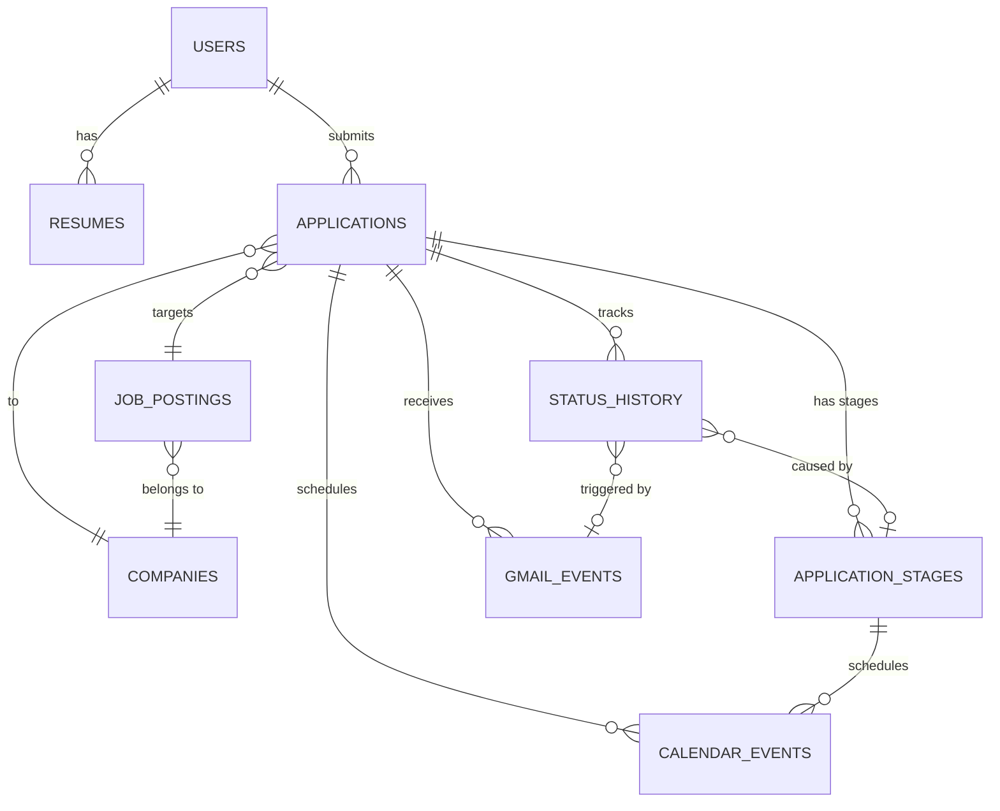
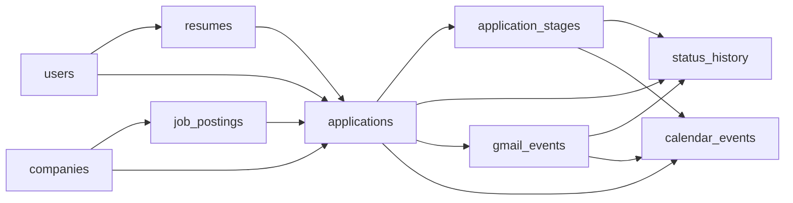

# Slayer — DB 설계서 (Database Schema Design)

> ARCH_DIAGRAM.md 기반. Google Cloud SQL (PostgreSQL) 사용.

---

## ERD 개요



---

## Table 1: `users`

사용자 계정 및 OAuth 인증 정보.

| 컬럼명 | 타입 | 제약 | 설명 |
|:---|:---|:---|:---|
| `id` | UUID | PK, DEFAULT gen_random_uuid() | 사용자 고유 ID |
| `google_id` | VARCHAR(255) | UNIQUE, NOT NULL | Google OAuth sub (고유 ID) |
| `email` | VARCHAR(255) | UNIQUE, NOT NULL | Google 이메일 |
| `name` | VARCHAR(100) | NOT NULL | 사용자 이름 |
| `picture_url` | TEXT | NULLABLE | Google 프로필 이미지 URL |
| `google_access_token` | TEXT | NULLABLE | Google API 접근 토큰 (암호화 저장) |
| `google_refresh_token` | TEXT | NULLABLE | 갱신용 토큰 (암호화 저장) |
| `token_expires_at` | TIMESTAMPTZ | NULLABLE | 액세스 토큰 만료 시각 |
| `gmail_last_history_id` | VARCHAR(50) | NULLABLE | Gmail API history ID (마지막 폴링 위치) |
| `gmail_last_poll_at` | TIMESTAMPTZ | NULLABLE | 마지막 Gmail 폴링 시각 |
| `created_at` | TIMESTAMPTZ | DEFAULT now() | 계정 생성 일시 |
| `updated_at` | TIMESTAMPTZ | DEFAULT now() | 최근 수정 일시 |

> [!IMPORTANT]
> `google_access_token`, `google_refresh_token`은 반드시 **암호화(AES-256)** 후 저장. 평문 저장 절대 금지.

---

## Table 2: `resumes`

사용자가 업로드한 원본 이력서 및 OCR 파싱 결과.

| 컬럼명 | 타입 | 제약 | 설명 |
|:---|:---|:---|:---|
| `id` | UUID | PK | 이력서 고유 ID |
| `user_id` | UUID | FK → users.id, NOT NULL | 소유 사용자 |
| `file_name` | VARCHAR(255) | NOT NULL | 원본 파일명 (예: resume_v3.pdf) |
| `file_type` | VARCHAR(10) | NOT NULL | `pdf` 또는 `docx` |
| `file_url` | TEXT | NOT NULL | 파일 저장 경로 (GCS / S3 URL) |
| `parse_status` | VARCHAR(20) | NOT NULL, DEFAULT `pending` | `pending \| processing \| success \| failed` |
| `parsed_data` | JSONB | NULLABLE | OCR Pipeline 출력 JSON 전체 (구조는 명세서 참고) |
| `parse_error` | TEXT | NULLABLE | 파싱 실패 시 에러 메시지 |
| `is_primary` | BOOLEAN | DEFAULT false | 기본 이력서 여부 (한 명당 1개) |
| `created_at` | TIMESTAMPTZ | DEFAULT now() | 업로드 일시 |
| `updated_at` | TIMESTAMPTZ | DEFAULT now() | 최근 파싱 갱신 일시 |

**인덱스:** `user_id`, `parse_status`

**`parsed_data` JSONB 구조 요약:**
```json
{
  "profile": { "name": "", "email": "", "phone": "", "links": {} },
  "summary": "",
  "education": [],
  "experience": [],
  "projects": [],
  "skills": { "technical": [], "soft_skills": [] },
  "certifications": [],
  "languages": [],
  "awards": []
}
```
→ 상세 스펙은 **DATA_SPEC.md §1** 참고.

---

## Table 3: `companies`

리서치 Agent가 수집한 기업 정보. (`feat/company-research` 구조 반영)

| 컬럼명 | 타입 | 제약 | 설명 |
|:---|:---|:---|:---|
| `id` | UUID | PK | 기업 고유 ID |
| `name` | VARCHAR(255) | UNIQUE, NOT NULL | 기업명 (국문) |
| `name_en` | VARCHAR(255) | NULLABLE | 기업명 (영문) |
| `crno` | VARCHAR(20) | NULLABLE, UNIQUE | 법인등록번호 |
| `ceo` | VARCHAR(100) | NULLABLE | 대표자명 |
| `founded_date` | VARCHAR(8) | NULLABLE | 설립일 (YYYYMMDD) |
| `employee_count` | INTEGER | NULLABLE | 임직원 수 |
| `headquarters` | TEXT | NULLABLE | 본사 주소 |
| `revenue` | BIGINT | NULLABLE | 최근 재무년도 매출액 (원) |
| `operating_profit` | BIGINT | NULLABLE | 최근 재무년도 영업이익 (원) |
| `fiscal_year` | VARCHAR(4) | NULLABLE | 재무년도 (예: 2024) |
| `recent_news` | JSONB | NULLABLE | 최근 뉴스 목록 배열 |
| `summary` | TEXT | NULLABLE | 기업 리서치 종합 요약 (구직자 관점) |
| `data_sources` | JSONB | NULLABLE | 정보 출처 배열 (`naver_news`, `corp_info` 등) |
| `researched_at` | TIMESTAMPTZ | NULLABLE | 리서치 최근 수행 시각 |
| `created_at` | TIMESTAMPTZ | DEFAULT now() | 등록 일시 |

**인덱스:** `name`, `crno`

---

## Table 4: `job_postings`

JD Pipeline이 파싱한 채용공고 정보.

| 컬럼명 | 타입 | 제약 | 설명 |
|:---|:---|:---|:---|
| `id` | UUID | PK | 공고 고유 ID |
| `company_id` | UUID | FK → companies.id | 해당 기업 |
| `source_url` | TEXT | NULLABLE | 원본 공고 URL |
| `source_platform` | VARCHAR(50) | NULLABLE | `wanted \| jobkorea \| saramin \| other` |
| `position` | VARCHAR(255) | NOT NULL | 포지션 명 |
| `required_skills` | JSONB | NULLABLE | 필수 기술스택 배열 |
| `preferred_skills` | JSONB | NULLABLE | 우대 기술스택 배열 |
| `qualifications` | TEXT | NULLABLE | 자격요건 원문 |
| `responsibilities` | TEXT | NULLABLE | 주요업무 원문 |
| `deadline` | DATE | NULLABLE | 지원 마감일 |
| `parsed_data` | JSONB | NULLABLE | JD Pipeline 출력 전체 JSON |
| `created_at` | TIMESTAMPTZ | DEFAULT now() | 등록 일시 |

**인덱스:** `company_id`, `deadline`

---

## Table 5: `applications` ⭐ 핵심 테이블

지원 현황의 중심 테이블. 모든 파이프라인이 이 테이블을 읽고 씁니다.

| 컬럼명 | 타입 | 제약 | 설명 |
|:---|:---|:---|:---|
| `id` | UUID | PK | 지원 고유 ID |
| `user_id` | UUID | FK → users.id, NOT NULL | 지원한 사용자 |
| `company_id` | UUID | FK → companies.id, NOT NULL | 지원 기업 |
| `job_posting_id` | UUID | FK → job_postings.id, NULLABLE | 연결된 채용공고 |
| `resume_id` | UUID | FK → resumes.id, NULLABLE | 사용한 이력서 |
| `status` | VARCHAR(30) | NOT NULL, DEFAULT `scrapped` | 아래 Enum 참고 |
| `ats_score` | SMALLINT | NULLABLE | JD-이력서 ATS 매칭 점수 (0~100) |
| `gap_summary` | TEXT | NULLABLE | 갭 분석 요약 (Match Pipeline 출력) |
| `matching_keywords` | JSONB | NULLABLE | 매칭된 키워드 배열 |
| `missing_keywords` | JSONB | NULLABLE | 부족한 키워드 배열 |
| `optimized_resume_url` | TEXT | NULLABLE | 최적화된 이력서 파일 URL |
| `cover_letter` | TEXT | NULLABLE | 자기소개서 초안 |
| `interview_questions` | JSONB | NULLABLE | 예상 면접 질문 + 답변 초안 |
| `applied_at` | TIMESTAMPTZ | NULLABLE | 실제 지원 완료 일시 |
| `deadline` | DATE | NULLABLE | 지원 마감일 (JD에서 복사) |
| `notes` | TEXT | NULLABLE | 사용자 메모 |
| `created_at` | TIMESTAMPTZ | DEFAULT now() | 레코드 생성 일시 |
| `updated_at` | TIMESTAMPTZ | DEFAULT now() | 최종 수정 일시 |

**`status` Enum (상위 상태):**

| 값 | 설명 |
|:---|:---|
| `scrapped` | 스크랩 (관심 저장) |
| `reviewing` | 검토 중 |
| `applied` | 서류 제출 완료 |
| `in_progress` | 전형 진행 중 (상세는 `application_stages` 참조) |
| `final_pass` | 최종 합격 |
| `rejected` | 불합격 |
| `withdrawn` | 지원 취소 |

**인덱스:** `user_id`, `company_id`, `status`, `deadline`

---

## Table 6: `application_stages` ⭐ 전형 단계

> 회사별로 다른 채용 프로세스를 유연하게 추적. 코딩테스트, 과제, AI면접 등 자유 입력.

| 컬럼명 | 타입 | 제약 | 설명 |
|:---|:---|:---|:---|
| `id` | UUID | PK | 단계 고유 ID |
| `application_id` | UUID | FK → applications.id, NOT NULL | 해당 지원 건 |
| `stage_name` | VARCHAR(100) | NOT NULL | "서류전형", "코딩테스트", "과제전형", "1차면접" 등 |
| `stage_order` | SMALLINT | NOT NULL | 전형 순서 (1, 2, 3...) |
| `status` | VARCHAR(20) | NOT NULL, DEFAULT `pending` | `pending \| passed \| failed` |
| `scheduled_at` | TIMESTAMPTZ | NULLABLE | 예정 일시 (면접 날짜 등) |
| `completed_at` | TIMESTAMPTZ | NULLABLE | 완료 일시 |
| `notes` | TEXT | NULLABLE | 메모 |
| `created_at` | TIMESTAMPTZ | DEFAULT now() | 등록 일시 |

**인덱스:** `application_id`, `(application_id, stage_order)` UNIQUE

---

## Table 7: `status_history` ⭐ 상태 변경 이력

> **"왜 이 상태가 바뀌었는지"** 를 추적하는 핵심 테이블. 모든 status 변경은 이 테이블에 기록됩니다.

| 컬럼명 | 타입 | 제약 | 설명 |
|:---|:---|:---|:---|
| `id` | UUID | PK | 이력 고유 ID |
| `user_id` | UUID | FK → users.id, NOT NULL | 해당 사용자 |
| `application_id` | UUID | FK → applications.id, NOT NULL | 해당 지원 건 |
| `previous_status` | VARCHAR(30) | NOT NULL | 변경 전 상태 |
| `new_status` | VARCHAR(30) | NOT NULL | 변경 후 상태 |
| `trigger_type` | VARCHAR(30) | NOT NULL | 변경 원인 유형 (아래 Enum 참고) |
| `triggered_by` | VARCHAR(30) | NOT NULL | `user \| gmail_monitor \| apply_pipeline \| agent` |
| `stage_id` | UUID | FK → application_stages.id, NULLABLE | 관련 전형 단계 (단계 변경으로 상위 상태가 바뀐 경우) |
| `evidence_gmail_event_id` | UUID | FK → gmail_events.id, NULLABLE | 근거 Gmail 이벤트 (메일 기반 변경 시) |
| `evidence_summary` | TEXT | NULLABLE | 변경 근거 요약 (예: "네카라쿠배 면접 안내 메일 수신") |
| `note` | TEXT | NULLABLE | 사용자 메모 또는 추가 설명 |
| `created_at` | TIMESTAMPTZ | DEFAULT now() | 변경 발생 일시 |

**`trigger_type` Enum:**

| 값 | 설명 | 예시 |
|:---|:---|:---|
| `email_detected` | Gmail Monitor가 메일 감지 | 면접 안내 메일 수신 → `applied → interview_1` |
| `user_manual` | 사용자가 직접 수동 변경 | 사용자가 지원 취소 클릭 → `interview_1 → withdrawn` |
| `apply_action` | Apply Pipeline 자동 실행 | 지원 승인 완료 → `reviewing → applied` |
| `agent_auto` | Agent가 자동 판단 | 마감일 경과 후 자동 변경 |

**인덱스:** `application_id`, `trigger_type`, `created_at`

> [!TIP]
> `evidence_gmail_event_id`로 **"이 메일 때문에 상태가 바뀌었다"** 를 바로 역추적할 수 있습니다.

---

## Table 8: `gmail_events`

Gmail Monitor가 감지한 이메일 이벤트 원본 및 파싱 결과.

| 컬럼명 | 타입 | 제약 | 설명 |
|:---|:---|:---|:---|
| `id` | UUID | PK | 이벤트 고유 ID |
| `user_id` | UUID | FK → users.id, NOT NULL | 수신 사용자 |
| `application_id` | UUID | FK → applications.id, NULLABLE | 연결된 지원 건 (매칭 성공 시) |
| `gmail_message_id` | VARCHAR(255) | UNIQUE, NOT NULL | Gmail API message ID (중복 처리 방지) |
| `subject` | TEXT | NULLABLE | 이메일 제목 |
| `sender` | VARCHAR(255) | NULLABLE | 발신자 이메일 |
| `received_at` | TIMESTAMPTZ | NOT NULL | 수신 일시 |
| `raw_snippet` | TEXT | NULLABLE | Gmail snippet (미리보기 텍스트) |
| `parsed_company` | VARCHAR(255) | NULLABLE | LLM이 추출한 기업명 |
| `parsed_status_type` | VARCHAR(20) | NULLABLE | `PASS \| FAIL \| INTERVIEW \| REJECT` |
| `parsed_stage_name` | VARCHAR(100) | NULLABLE | LLM이 추출한 전형 단계명 ("코딩테스트", "1차면접" 등) |
| `parsed_next_step` | TEXT | NULLABLE | 다음 단계 안내 텍스트 |
| `interview_datetime` | TIMESTAMPTZ | NULLABLE | 면접 일정 (면접 안내 메일인 경우) |
| `interview_location` | TEXT | NULLABLE | 면접 장소 |
| `interview_format` | VARCHAR(20) | NULLABLE | `online \| offline` |
| `raw_summary` | TEXT | NULLABLE | LLM 요약 원문 |
| `process_status` | VARCHAR(20) | DEFAULT `unprocessed` | `unprocessed \| processed \| error` |
| `created_at` | TIMESTAMPTZ | DEFAULT now() | 감지 일시 |

**인덱스:** `user_id`, `gmail_message_id` (UNIQUE), `process_status`, `received_at`

---

## Table 9: `calendar_events`

Google Calendar 등록 내역.

| 컬럼명 | 타입 | 제약 | 설명 |
|:---|:---|:---|:---|
| `id` | UUID | PK | 레코드 고유 ID |
| `user_id` | UUID | FK → users.id, NOT NULL | 사용자 |
| `application_id` | UUID | FK → applications.id, NULLABLE | 연결된 지원 건 |
| `gmail_event_id` | UUID | FK → gmail_events.id, NULLABLE | 연결된 Gmail 이벤트 |
| `stage_id` | UUID | FK → application_stages.id, NULLABLE | 연결된 전형 단계 |
| `google_event_id` | VARCHAR(255) | UNIQUE, NULLABLE | Google Calendar event ID |
| `event_type` | VARCHAR(30) | NOT NULL | `deadline \| interview \| follow_up` |
| `title` | VARCHAR(255) | NOT NULL | 캘린더 이벤트 제목 |
| `description` | TEXT | NULLABLE | 이벤트 상세 내용 |
| `start_datetime` | TIMESTAMPTZ | NOT NULL | 시작 일시 |
| `end_datetime` | TIMESTAMPTZ | NULLABLE | 종료 일시 |
| `location` | TEXT | NULLABLE | 장소 |
| `is_all_day` | BOOLEAN | DEFAULT false | 종일 이벤트 여부 |
| `sync_status` | VARCHAR(20) | DEFAULT `pending` | `pending \| synced \| failed` |
| `created_at` | TIMESTAMPTZ | DEFAULT now() | 등록 일시 |

**인덱스:** `user_id`, `application_id`, `event_type`, `start_datetime`

---


## 테이블 관계 요약



---

## 인프라

| 항목 | 내용 |
|:---|:---|
| **DB** | Google Cloud SQL (PostgreSQL) |
| **향후** | 필요 시 Redis 캐시 레이어 추가 |

> [!TIP]
> `updated_at` 컬럼은 PostgreSQL 트리거로 자동 갱신 처리 필요.
