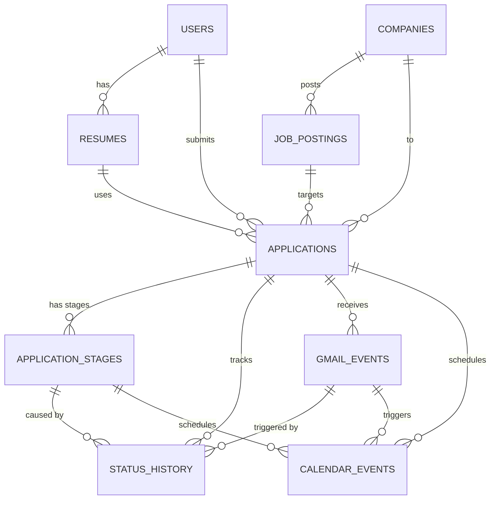
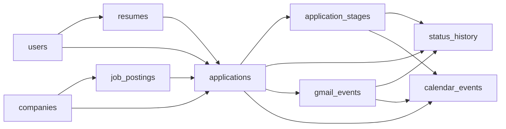

# Slayer — DB 설계서 (Database Schema Design)

> `slayer/schemas.py` 기반. Supabase PostgreSQL 사용.
> ORM 정의: `slayer/db/models.py`

---

## ERD 개요



---

## Table 1: `users`

사용자 계정 및 OAuth 인증 정보.

| 컬럼명 | 타입 | 제약 | 설명 |
|:---|:---|:---|:---|
| `id` | UUID | PK, DEFAULT gen_random_uuid() | 사용자 고유 ID |
| `google_id` | VARCHAR(255) | UNIQUE, NOT NULL | Google OAuth sub |
| `email` | VARCHAR(255) | UNIQUE, NOT NULL | Google 이메일 |
| `name` | VARCHAR(100) | NOT NULL | 사용자 이름 |
| `picture_url` | TEXT | NULLABLE | Google 프로필 이미지 URL |
| `google_access_token` | TEXT | NULLABLE | Google API 접근 토큰 (암호화 저장) |
| `google_refresh_token` | TEXT | NULLABLE | 갱신용 토큰 (암호화 저장) |
| `token_expires_at` | TIMESTAMPTZ | NULLABLE | 액세스 토큰 만료 시각 |
| `gmail_last_history_id` | VARCHAR(50) | NULLABLE | Gmail API history ID (마지막 폴링 위치) |
| `gmail_last_poll_at` | TIMESTAMPTZ | NULLABLE | 마지막 Gmail 폴링 시각 |
| `created_at` | TIMESTAMPTZ | DEFAULT now() | 계정 생성 일시 |
| `updated_at` | TIMESTAMPTZ | DEFAULT now() | 최근 수정 일시 |

> [!IMPORTANT]
> `google_access_token`, `google_refresh_token`은 반드시 **암호화(AES-256)** 후 저장. 평문 저장 절대 금지.

---

## Table 2: `resumes`

사용자가 업로드한 원본 이력서 및 OCR 파싱 결과.

| 컬럼명 | 타입 | 제약 | 설명 |
|:---|:---|:---|:---|
| `id` | UUID | PK | 이력서 고유 ID |
| `user_id` | UUID | FK → users.id, NOT NULL | 소유 사용자 |
| `file_name` | VARCHAR(255) | NOT NULL | 원본 파일명 (예: resume_v3.pdf) |
| `file_type` | VARCHAR(10) | NOT NULL | `pdf` \| `docx` |
| `source_format` | VARCHAR(10) | NULLABLE | 파싱 소스 포맷: `pdf` \| `docx` \| `md` \| `json` \| `txt` |
| `file_url` | TEXT | NOT NULL | 파일 저장 경로 (GCS / S3 URL) |
| `parse_status` | VARCHAR(20) | NOT NULL, DEFAULT `pending` | `pending` \| `processing` \| `success` \| `failed` |
| `parsed_data` | JSONB | NULLABLE | `ParsedResume` 스키마 전체 |
| `parse_error` | TEXT | NULLABLE | 파싱 실패 시 에러 메시지 |
| `is_primary` | BOOLEAN | DEFAULT false | 기본 이력서 여부 (한 명당 1개) |
| `created_at` | TIMESTAMPTZ | DEFAULT now() | 업로드 일시 |
| `updated_at` | TIMESTAMPTZ | DEFAULT now() | 최근 파싱 갱신 일시 |

**인덱스:** `user_id`

**`parsed_data` JSONB 구조:** → `schemas.py: ParsedResume` 참조

---

## Table 3: `companies`

리서치 Agent가 수집한 기업 정보. → `schemas.py: CompanyResearchOutput` 기반.

| 컬럼명 | 타입 | 제약 | 설명 |
|:---|:---|:---|:---|
| `id` | UUID | PK | 기업 고유 ID |
| `name` | VARCHAR(255) | UNIQUE, NOT NULL | 기업명 (국문) |
| `name_en` | VARCHAR(255) | NULLABLE | 기업명 (영문) |
| `crno` | VARCHAR(20) | UNIQUE, NULLABLE | 법인등록번호 |
| `industry` | VARCHAR(100) | NULLABLE | 업종 |
| `ceo` | VARCHAR(100) | NULLABLE | 대표자명 |
| `founded_date` | VARCHAR(20) | NULLABLE | 설립일 (API 원본 형식 그대로, 예: "19690113") |
| `employee_count` | VARCHAR(50) | NULLABLE | 임직원 수 (API 원본 형식 그대로, 예: "28,394") |
| `headquarters` | VARCHAR(255) | NULLABLE | 본사 주소 |
| `summary` | TEXT | NULLABLE | 기업 리서치 종합 요약 (구직자 관점) |
| `basic_info` | JSONB | NULLABLE | `BasicInfo` 스키마 전체 |
| `financial_info` | JSONB | NULLABLE | `FinancialInfo` 스키마 전체 |
| `recent_news` | JSONB | NULLABLE | `list[NewsItem]` |
| `data_sources` | JSONB | NULLABLE | 정보 출처 배열 (`["naver_news", "corp_info"]`) |
| `researched_at` | TIMESTAMPTZ | NULLABLE | 리서치 최근 수행 시각 |
| `created_at` | TIMESTAMPTZ | DEFAULT now() | 등록 일시 |

**인덱스:** `name` (UNIQUE), `crno` (UNIQUE)

> [!NOTE]
> 검색/필터 대상 필드(`name`, `industry`, `ceo` 등)는 컬럼으로 승격.
> API 응답 전체는 `basic_info`/`financial_info` JSONB에 보존하여 상세 보기용으로 사용.

---

## Table 4: `job_postings`

JD Pipeline이 파싱한 채용공고 정보. → `schemas.py: JDSchema` 기반.

| 컬럼명 | 타입 | 제약 | 설명 |
|:---|:---|:---|:---|
| `id` | UUID | PK | 공고 고유 ID |
| `company_id` | UUID | FK → companies.id | 해당 기업 |
| `source_url` | TEXT | NULLABLE | 원본 공고 URL |
| `platform` | VARCHAR(50) | NULLABLE | `wanted` \| `jobkorea` \| `saramin` \| `other` |
| `title` | VARCHAR(255) | NULLABLE | 공고 제목 |
| `position` | VARCHAR(255) | NOT NULL | 포지션명 |
| `location` | VARCHAR(255) | NULLABLE | 근무지 (JDOverview.location) |
| `employment_type` | VARCHAR(50) | NULLABLE | 고용 형태 (JDOverview.employment_type) |
| `experience_level` | VARCHAR(50) | NULLABLE | 경력 요건 (JDOverview.experience) |
| `skills` | JSONB | NULLABLE | 정규화된 스킬 리스트 (ATS 매칭용, 소문자) |
| `deadline` | DATE | NULLABLE | 지원 마감일 |
| `parsed_data` | JSONB | NULLABLE | `JDSchema` 전체 (requirements, responsibilities 등 포함) |
| `created_at` | TIMESTAMPTZ | DEFAULT now() | 등록 일시 |

**인덱스:** `company_id`, `skills` (GIN)

> [!NOTE]
> 검색/필터용 필드(`title`, `location`, `skills` 등)는 컬럼으로 승격.
> JD 상세 정보(requirements, responsibilities, benefits 등)는 `parsed_data` JSONB에 통합.

---

## Table 5: `applications` — 핵심 테이블

지원 현황의 중심 테이블. 모든 파이프라인이 이 테이블을 읽고 씁니다.

| 컬럼명 | 타입 | 제약 | 설명 |
|:---|:---|:---|:---|
| `id` | UUID | PK | 지원 고유 ID |
| `user_id` | UUID | FK → users.id, NOT NULL | 지원한 사용자 |
| `company_id` | UUID | FK → companies.id, NOT NULL | 지원 기업 |
| `job_posting_id` | UUID | FK → job_postings.id, NULLABLE | 연결된 채용공고 |
| `resume_id` | UUID | FK → resumes.id, NULLABLE | 사용한 이력서 |
| `status` | VARCHAR(30) | NOT NULL, DEFAULT `scrapped` | 상위 상태 (아래 Enum 참고) |
| `ats_score` | FLOAT | NULLABLE | JD-이력서 ATS 매칭 점수 (0~100) |
| `score_breakdown` | JSONB | NULLABLE | 가중치별 점수 (`MatchResult.score_breakdown`) |
| `matched_keywords` | JSONB | NULLABLE | 매칭된 키워드 배열 |
| `missing_keywords` | JSONB | NULLABLE | 부족한 키워드 배열 |
| `strengths` | JSONB | NULLABLE | 강점 분석 (`MatchResult.strengths`) |
| `weaknesses` | JSONB | NULLABLE | 약점 분석 (`MatchResult.weaknesses`) |
| `gap_summary` | TEXT | NULLABLE | 갭 분석 요약 |
| `optimized_resume_url` | TEXT | NULLABLE | 최적화된 이력서 파일 URL |
| `optimization_data` | JSONB | NULLABLE | `ResumeOptimizationOutput` 전체 |
| `cover_letter_text` | TEXT | NULLABLE | 자기소개서 본문 |
| `cover_letter_metadata` | JSONB | NULLABLE | 자소서 메타 (`key_points`, `jd_keyword_coverage`, `word_count`) |
| `interview_questions` | JSONB | NULLABLE | 예상 면접 질문 + 답변 초안 |
| `applied_at` | TIMESTAMPTZ | NULLABLE | 실제 지원 완료 일시 |
| `deadline` | DATE | NULLABLE | 지원 마감일 (JD에서 복사) |
| `notes` | TEXT | NULLABLE | 사용자 메모 |
| `created_at` | TIMESTAMPTZ | DEFAULT now() | 레코드 생성 일시 |
| `updated_at` | TIMESTAMPTZ | DEFAULT now() | 최종 수정 일시 |

**`status` Enum (상위 상태 — 7개):**

| 값 | 설명 |
|:---|:---|
| `scrapped` | 스크랩 (관심 저장) |
| `reviewing` | 검토 중 |
| `applied` | 서류 제출 완료 |
| `in_progress` | 전형 진행 중 (상세는 `application_stages` 참조) |
| `final_pass` | 최종 합격 |
| `rejected` | 불합격 |
| `withdrawn` | 지원 취소 |

**상태 전이 규칙:**
```
scrapped → reviewing → applied → in_progress → final_pass
[any state] → rejected | withdrawn  (언제든 가능)
```

**인덱스:** `(user_id, status)` 복합, `job_posting_id`, `resume_id`

---

## Table 6: `application_stages` — 전형 단계

회사별로 다른 채용 프로세스를 유연하게 추적.

| 컬럼명 | 타입 | 제약 | 설명 |
|:---|:---|:---|:---|
| `id` | UUID | PK | 단계 고유 ID |
| `application_id` | UUID | FK → applications.id, NOT NULL | 해당 지원 건 |
| `stage_name` | VARCHAR(100) | NOT NULL | "서류전형", "코딩테스트", "과제전형", "1차면접", "AI면접" 등 |
| `stage_order` | INTEGER | NOT NULL | 전형 순서 (1, 2, 3...) |
| `status` | VARCHAR(20) | NOT NULL, DEFAULT `pending` | `pending` \| `passed` \| `failed` |
| `scheduled_at` | TIMESTAMPTZ | NULLABLE | 예정 일시 (면접 날짜 등) |
| `completed_at` | TIMESTAMPTZ | NULLABLE | 완료 일시 |
| `notes` | TEXT | NULLABLE | 메모 |
| `created_at` | TIMESTAMPTZ | DEFAULT now() | 등록 일시 |

**인덱스:** `application_id`

**사용 예시:**
```
카카오 지원 (application)
  ├── 1. 서류전형    → passed
  ├── 2. 코딩테스트  → passed
  ├── 3. 과제전형    → passed
  ├── 4. 1차면접     → pending (scheduled: 03-28)
  └── 5. 2차면접     → pending
```

---

## Table 7: `status_history`

**"왜 이 상태가 바뀌었는지"** 를 추적하는 감사(audit) 테이블.

| 컬럼명 | 타입 | 제약 | 설명 |
|:---|:---|:---|:---|
| `id` | UUID | PK | 이력 고유 ID |
| `user_id` | UUID | FK → users.id, NOT NULL | 해당 사용자 |
| `application_id` | UUID | FK → applications.id, NOT NULL | 해당 지원 건 |
| `stage_id` | UUID | FK → application_stages.id, NULLABLE | 관련 전형 단계 |
| `previous_status` | VARCHAR(30) | NOT NULL | 변경 전 상태 |
| `new_status` | VARCHAR(30) | NOT NULL | 변경 후 상태 |
| `trigger_type` | VARCHAR(30) | NOT NULL | 변경 원인 유형 (아래 Enum 참고) |
| `triggered_by` | VARCHAR(30) | NOT NULL | `user` \| `gmail_monitor` \| `apply_pipeline` \| `agent` |
| `evidence_gmail_event_id` | UUID | FK → gmail_events.id, NULLABLE | 근거 Gmail 이벤트 |
| `evidence_summary` | TEXT | NULLABLE | 변경 근거 요약 |
| `note` | TEXT | NULLABLE | 추가 설명 |
| `created_at` | TIMESTAMPTZ | DEFAULT now() | 변경 발생 일시 |

**`trigger_type` Enum:**

| 값 | 설명 | 예시 |
|:---|:---|:---|
| `email_detected` | Gmail Monitor가 메일 감지 | 면접 안내 메일 → `applied → in_progress` |
| `user_manual` | 사용자가 직접 수동 변경 | 지원 취소 클릭 → `withdrawn` |
| `apply_action` | Apply Pipeline 자동 실행 | 지원 완료 → `reviewing → applied` |
| `agent_auto` | Agent가 자동 판단 | 마감일 경과 후 자동 변경 |

**인덱스:** `application_id`, `user_id`, `stage_id`

---

## Table 8: `gmail_events`

Gmail Monitor가 감지한 이메일 이벤트 원본 및 파싱 결과. → `schemas.py: GmailParseResult` 기반.

| 컬럼명 | 타입 | 제약 | 설명 |
|:---|:---|:---|:---|
| `id` | UUID | PK | 이벤트 고유 ID |
| `user_id` | UUID | FK → users.id, NOT NULL | 수신 사용자 |
| `application_id` | UUID | FK → applications.id, NULLABLE | 연결된 지원 건 (매칭 성공 시) |
| `gmail_message_id` | VARCHAR(255) | UNIQUE, NOT NULL | Gmail API message ID (중복 방지) |
| `subject` | TEXT | NULLABLE | 이메일 제목 |
| `sender` | VARCHAR(255) | NULLABLE | 발신자 이메일 |
| `received_at` | TIMESTAMPTZ | NOT NULL | 수신 일시 |
| `raw_snippet` | TEXT | NULLABLE | Gmail snippet (미리보기 텍스트) |
| `parsed_company` | VARCHAR(255) | NULLABLE | LLM이 추출한 기업명 |
| `parsed_status_type` | VARCHAR(20) | NULLABLE | `PASS` \| `FAIL` \| `INTERVIEW` \| `REJECT` |
| `parsed_stage_name` | VARCHAR(100) | NULLABLE | LLM이 추출한 전형 단계명 ("코딩테스트", "1차면접" 등) |
| `parsed_next_step` | TEXT | NULLABLE | 다음 단계 안내 텍스트 |
| `interview_datetime` | TIMESTAMPTZ | NULLABLE | 면접 일정 (면접 안내 메일인 경우) |
| `interview_details` | JSONB | NULLABLE | `InterviewDetails` (location, format, platform, duration_minutes) |
| `raw_summary` | TEXT | NULLABLE | LLM 요약 원문 |
| `process_status` | VARCHAR(20) | DEFAULT `unprocessed` | `unprocessed` \| `processed` \| `error` |
| `created_at` | TIMESTAMPTZ | DEFAULT now() | 감지 일시 |

**인덱스:** `user_id`, `application_id`, `gmail_message_id` (UNIQUE)

---

## Table 9: `calendar_events`

Google Calendar 등록 내역. → `schemas.py: CalendarEventResult` 기반.

| 컬럼명 | 타입 | 제약 | 설명 |
|:---|:---|:---|:---|
| `id` | UUID | PK | 레코드 고유 ID |
| `user_id` | UUID | FK → users.id, NOT NULL | 사용자 |
| `application_id` | UUID | FK → applications.id, NULLABLE | 연결된 지원 건 |
| `stage_id` | UUID | FK → application_stages.id, NULLABLE | 연결된 전형 단계 |
| `gmail_event_id` | UUID | FK → gmail_events.id, NULLABLE | 연결된 Gmail 이벤트 |
| `google_event_id` | VARCHAR(255) | UNIQUE, NULLABLE | Google Calendar event ID |
| `event_type` | VARCHAR(30) | NOT NULL | `deadline` \| `interview` \| `follow_up` |
| `title` | VARCHAR(255) | NOT NULL | 캘린더 이벤트 제목 |
| `description` | TEXT | NULLABLE | 이벤트 상세 내용 |
| `start_datetime` | TIMESTAMPTZ | NOT NULL | 시작 일시 |
| `end_datetime` | TIMESTAMPTZ | NULLABLE | 종료 일시 |
| `location` | TEXT | NULLABLE | 장소 |
| `is_all_day` | BOOLEAN | DEFAULT false | 종일 이벤트 여부 |
| `sync_status` | VARCHAR(20) | DEFAULT `pending` | `pending` \| `synced` \| `failed` |
| `created_at` | TIMESTAMPTZ | DEFAULT now() | 등록 일시 |

**인덱스:** `user_id`, `application_id`, `stage_id`, `gmail_event_id`

---

## Table 10: `agent_logs`

Agent/Pipeline 실행 로그. 전용 observability 도구(Langfuse 등) 도입 시 대체 가능.

| 컬럼명 | 타입 | 제약 | 설명 |
|:---|:---|:---|:---|
| `id` | UUID | PK | 로그 고유 ID |
| `user_id` | UUID | FK → users.id, NULLABLE | 실행 사용자 |
| `application_id` | UUID | FK → applications.id, NULLABLE | 관련 지원 건 |
| `agent_name` | VARCHAR(100) | NOT NULL | `jd_parser` \| `gmail_monitor` \| `company_research` \| ... |
| `status` | VARCHAR(20) | NOT NULL | `success` \| `failed` \| `partial` |
| `input_summary` | TEXT | NULLABLE | 입력 요약 |
| `output_summary` | TEXT | NULLABLE | 출력 요약 |
| `tokens_used` | INTEGER | NULLABLE | LLM 토큰 사용량 |
| `duration_ms` | INTEGER | NULLABLE | 실행 시간 (ms) |
| `error_message` | TEXT | NULLABLE | 에러 메시지 |
| `extra_metadata` | JSONB | NULLABLE | 추가 메타데이터 |
| `created_at` | TIMESTAMPTZ | DEFAULT now() | 실행 일시 |

**인덱스:** `user_id`, `application_id`

---

## 테이블 관계 요약



---

## 인프라

| 항목 | 내용 |
|:---|:---|
| **DB** | Supabase PostgreSQL (무료 티어, 500MB) |
| **ORM** | SQLAlchemy 2.0 + psycopg2-binary |
| **마이그레이션** | Alembic (예정) |
| **스키마 정의** | `slayer/schemas.py` (Pydantic v2) — 팀 합의 기준 |
| **ORM 정의** | `slayer/db/models.py` (SQLAlchemy) — schemas.py 기반 |

> [!TIP]
> `updated_at` 컬럼은 PostgreSQL 트리거로 자동 갱신 처리 필요.
