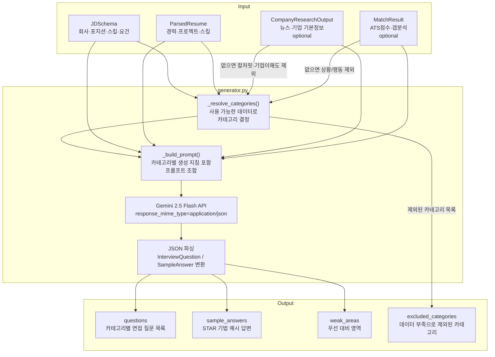

# 면접 질문 생성 파이프라인

담당: 현지
모듈 위치: `slayer/pipelines/interview_questions/`

---

## 개요

JD, 이력서, 기업 리서치, 매칭 분석 결과를 종합해 지원자가 실제 면접에서 받을 수 있는 질문을 카테고리별로 생성하고, 각 질문에 대한 예시 답변과 우선 대비 영역을 반환하는 파이프라인.

---

## 실행 구조



---

## Input

`InterviewQuestionsInput` (`slayer/schemas.py`)

| 필드 | 타입 | 필수 여부 | 설명 |
|------|------|-----------|------|
| `jd` | `JDSchema` | ✅ 필수 | 채용공고 파싱 결과 |
| `resume` | `ParsedResume` | ✅ 필수 | 이력서 파싱 결과 |
| `company_research` | `CompanyResearchOutput` | ⬜ 선택 | 없으면 컬처핏·기업이해도 카테고리 제외 |
| `match_result` | `MatchResult` | ⬜ 선택 | 없으면 상황/행동 카테고리 제외 |
| `categories` | `list[InterviewCategory]` | ⬜ 선택 | None이면 가능한 전체 카테고리 생성 |
| `questions_per_category` | `int` | ⬜ 선택 | 카테고리당 질문 수 (기본값 3, 최대 10) |

---

## Output

`InterviewQuestionsOutput` (`slayer/schemas.py`)

| 필드 | 타입 | 설명 |
|------|------|------|
| `questions` | `list[InterviewQuestion]` | 카테고리별 면접 질문 전체 목록 |
| `sample_answers` | `list[SampleAnswer]` | 카테고리별 1개씩 선정된 STAR 기법 예시 답변 |
| `weak_areas` | `list[str]` | 우선적으로 대비해야 할 영역 3~5개 |
| `excluded_categories` | `list[str]` | 데이터 부족으로 제외된 카테고리 (비어있으면 전체 생성됨) |

### sample_answers 설계 의도

전체 질문이 아닌 **카테고리별 1개씩**만 예시 답변을 제공한다.
모범 답변은 연습 참고용이므로 전부 제공할 필요가 없고, 나머지는 지원자가 직접 작성하도록 유도하는 설계다.
또한 질문 수가 많아질수록 Gemini 응답이 잘릴 수 있어 토큰 절감 효과도 있다.

### InterviewQuestion 구조

| 필드 | 설명 |
|------|------|
| `category` | 카테고리명 (아래 카테고리 참고) |
| `question` | 면접 질문 |
| `intent` | 면접관이 이 질문을 하는 이유 |
| `tip` | 답변 시 유의할 점 또는 전략 |
| `source` | 생성 근거 (예: `missing_keyword: Blender`, `company_news: 100만 사용자 돌파`) |

---

## 카테고리

| 카테고리 | 핵심 질문 | 필요한 입력 |
|---------|-----------|------------|
| `기술` | 기술적으로 일할 수 있는가? | JD skills + 이력서 skills |
| `경험` | 이력서에 쓴 내용이 실제 경험인가? | 이력서 경력·프로젝트 |
| `상황/행동` | 부족한 부분이 오면 어떻게 할 건가? | MatchResult gap (선택) |
| `인성` | 어떤 사람인가? 같이 일할 수 있는가? | 범용 |
| `컬처핏` | 우리 조직 방식에 맞는가? | 기업 리서치 (선택) |
| `기업 이해도` | 우리 회사를 알고 있는가? | 기업 리서치 (선택) |

---

## 사용법

```python
from slayer.pipelines.interview_questions import generate_interview_questions
from slayer.schemas import InterviewQuestionsInput

# 최소 입력 (JD + 이력서만)
result = generate_interview_questions(
    InterviewQuestionsInput(
        jd=jd,
        resume=resume,
    )
)
# → 기술, 경험, 인성 카테고리만 생성됨
# → result.excluded_categories == ["상황/행동", "컬처핏", "기업 이해도"]

# 전체 입력
result = generate_interview_questions(
    InterviewQuestionsInput(
        jd=jd,
        resume=resume,
        company_research=company_research,
        match_result=match_result,
        questions_per_category=3,
    )
)
# → 전체 6개 카테고리 생성됨
# → result.excluded_categories == []
```

---

## 테스트 실행

```bash
# 터미널 실시간 출력
uv run python scripts/test_interview_generator.py

# 터미널 출력 + 파일 저장 동시에
uv run python scripts/test_interview_generator.py 2>&1 | tee output.txt
```
