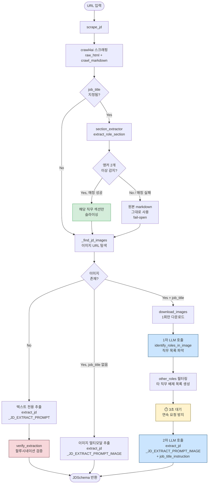

# JD Parser — 멀티-직무 공고 처리 개선

> 담당: 현지 | 브랜치: `feat/jd-parser-ui` | 작성일: 2026-04-08

---

## 배경 / 문제 정의

한 공고 URL에 비슷한 직무가 여러 개 있는 경우 (예: AI DevOps 엔지니어, AI MLOps 엔지니어),
기존 방식은 `job_title` 프롬프트 하나만 믿고 LLM 필터링을 맡겼음.
직무명이 서로 비슷하면 LLM이 내용을 섞거나, 이미지 기반 공고에서는 이미지를 읽지 않고
사전 학습 지식으로 전형적인 직무 내용을 채워 넣는 **할루시네이션** 발생.

### 두 가지 케이스

| 케이스 | 설명 | 예시 |
|---|---|---|
| **텍스트 기반** | crawl4ai raw_markdown에 여러 직무명이 표 형식으로 존재 | 잡코리아 클래식 표 포맷 |
| **이미지 기반** | JD 본문 전체가 이미지로 제공 | 효성ITX 공고 (file2.jobkorea.co.kr) |

---

## 전체 흐름



---

## 흐름 단계별 설명

### 1단계: 페이지 긁어오기

crawl4ai가 브라우저처럼 페이지를 열어서 두 가지를 가져옴:
- **raw_html** — 페이지의 HTML 원본
- **crawl_markdown** — 그 HTML을 사람이 읽기 쉬운 텍스트(마크다운)로 변환한 것

---

### 2단계: 텍스트에서 해당 직무만 잘라내기 (job_title이 있을 때만)

`--job-title "AI DevOps 엔지니어"` 처럼 직무명을 지정했을 때, 텍스트 안에 여러 직무가 섞여 있으면 해당 직무 부분만 잘라냄.

```
[전체 마크다운]                    [잘라낸 결과]
| **AI DevOps 엔지니어** |          | **AI DevOps 엔지니어** |
|  담당업무: CI/CD ...   |    →     |  담당업무: CI/CD ...   |
| **AI MLOps 엔지니어** |          (MLOps 내용은 버려짐)
|  담당업무: RAG ...     |
```

이미지 기반 공고처럼 텍스트에 직무 내용이 없으면 → 그냥 원본 전체를 다음 단계로 넘김.

---

### 3단계: 이미지가 있는지 확인

raw_html에서 `` 태그를 뒤져서 잡코리아 JD 이미지(`file2.jobkorea.co.kr`)가 있는지 확인.

- **없으면** → 텍스트만으로 LLM 추출 (4A)
- **있으면** → 이미지 포함해서 LLM 추출 (4B 또는 4C)

---

### 4A: 텍스트 전용 추출

이미지 없고, 직무 내용이 마크다운 텍스트에 다 있는 경우.

```
마크다운 텍스트 → Gemini → JDSchema
```

추출 후 `verify_extraction()`으로 "원문에 없는 단어가 너무 많이 포함됐는지" 검사.

---

### 4B: 이미지 단순 추출

이미지가 있는데 `--job-title`을 지정하지 않은 경우. 직무 구분 필요 없이 통째로 추출.

```
마크다운 + 이미지 → Gemini → JDSchema
```

---

### 4C: 이미지 + job_title → 2-pass 추출

이미지가 있고, 특정 직무를 지정한 경우. **이미지 다운로드 1회 + LLM 호출 2회**로 처리.

```
[이미지 다운로드 — 딱 1회]
        ↓
[1차 호출] 이미지 → Gemini
           "이 이미지에 어떤 직무들이 있어?"
           → ["AI DevOps 엔지니어", "AI MLOps 엔지니어"]
        ↓
[3초 대기] ← 연속 요청하면 503 에러 나서
        ↓
[2차 호출] 이미지 + 마크다운 → Gemini
           "AI DevOps 엔지니어 내용만 추출해.
            AI MLOps 엔지니어 내용은 절대 포함 금지."
           → JDSchema
```

**왜 2-pass가 필요하냐면**: 이미지 속에 두 직무가 나란히 있을 때, "DevOps만 봐" 한 마디보다 "MLOps는 절대 포함 금지"라고 명시적으로 배제 목록을 주는 게 훨씬 정확하기 때문.

---

### 각 단계의 안전장치

| 상황 | 처리 방법 |
|---|---|
| 텍스트에서 직무명 못 찾겠으면 | 자르지 않고 원본 전체를 다음 단계로 넘김 |
| Gemini가 503 (일시 과부하) | 1초 → 2초 → 4초 기다렸다가 재시도, 실패 시 gemini-2.0-flash로 전환 |
| Gemini가 429 (하루 할당량 소진) | 기다려봤자 의미 없으니 즉시 gemini-2.0-flash로 전환 |
| 이미지 다운로드 실패 | 그 이미지는 건너뛰고 나머지로 진행 |
| 1차 호출(직무 목록 파악)이 실패 | 배제 목록 없이 2차 호출 진행 |

---

## 변경 파일 상세

### 1. `slayer/pipelines/jd_parser/section_extractor.py` ✨ 신규

**역할**: 텍스트 기반 멀티-직무 공고에서 LLM 호출 없이 해당 직무 섹션만 잘라냄.

#### 동작 방식

```
| **AI DevOps 엔지니어**   ← 앵커 감지 (줄 끝에 내용 없음)
|  **담당업무** ㆍCI/CD    ← 필드 헤더 (제외, 줄 끝에 내용 있음)
...
| **AI MLOps 엔지니어**   ← 다음 앵커 → 여기서 섹션 종료
```

#### 핵심 함수

| 함수 | 역할 |
|---|---|
| `extract_role_section(md_text, job_title)` | 메인 함수. 실패 시 원본 반환 (fail-open) |
| `_find_role_anchors(md_text)` | 정규식으로 직무명 앵커 위치 탐색 |
| `_match_role(anchors, job_title)` | 대소문자 무시 포함 관계 → LCS 퍼지 매칭 |
| `_lcs_ratio(a, b)` | 최장 공통 부분문자열 비율 계산 |
| `_extract_header(md_text)` | 회사명/공고명 줄 추출 |
| `_extract_sidebar(md_text)` | 마감일·고용형태 등 공통 정보 추출 |

#### Fallback 동작

| 상황 | 동작 |
|---|---|
| 앵커 1개 이하 (단일 직무) | 원본 그대로 반환 |
| 매칭 score < 0.4 | 원본 그대로 반환 |
| 추출 섹션 < 200자 | 원본 그대로 반환 |
| 예외 발생 | 원본 그대로 반환 |

---

### 2. `slayer/pipelines/jd_parser/llm_client.py` 🔧 수정

#### 2-1. API 안정성: `_generate_with_retry()`

```
503 UNAVAILABLE  →  exponential backoff (1s → 2s → 4s)  →  최대 3회
                                                           실패 시 fallback 모델로 전환
429 RESOURCE_EXHAUSTED  →  backoff 없이 즉시 fallback 모델로 전환
                           (할당량 초과는 짧은 대기로 해결 불가)
gemini-2.0-flash도 실패  →  예외 raise
```

| 상수 | 값 | 역할 |
|---|---|---|
| `_MODEL` | `gemini-2.5-flash` | 기본 모델 |
| `_MODEL_FALLBACK` | `gemini-2.0-flash` | 503 실패 시 fallback |
| `_RETRY_STATUS` | `("503", "UNAVAILABLE")` | backoff 재시도 대상 |
| `_QUOTA_STATUS` | `("429", "RESOURCE_EXHAUSTED")` | 즉시 모델 전환 대상 |

#### 2-2. 이미지 처리: `download_images()`

기존에는 `identify_roles_in_image()`와 `extract_jd()` 각각이 이미지를 다운로드 → **동일 이미지 2회 다운로드 + 연속 API 호출** 문제.

`download_images(image_urls) → list[tuple[bytes, str]]`로 분리하여 **한 번만 다운로드**, 두 함수에 bytes를 직접 전달.

#### 2-3. 이미지 기반 할루시네이션: 프롬프트 분기

| 구분 | 프롬프트 | 핵심 차이 |
|---|---|---|
| 텍스트 공고 | `_JD_EXTRACT_PROMPT` | "원문 텍스트를 그대로 유지" |
| 이미지 공고 | `_JD_EXTRACT_PROMPT_IMAGE` | "이미지를 직접 읽어서만 추출, 직무명에서 연상되는 일반 내용(Kubernetes, 경력 3년 등) 추가 금지" |

**문제**: 기존 단일 프롬프트에서 이미지를 보조 수단으로 취급했기 때문에, 이미지 공고에서도 텍스트+사전지식 위주로 내용을 생성함.

#### 2-4. 멀티-직무 필터: `_JOB_TITLE_INSTRUCTION`

`{other_roles_block}` 플레이스홀더 추가. `other_roles`가 있으면 아래 형태로 삽입:

```
### 이 공고의 다른 모집부문 (절대 포함 금지)
- AI MLOps 엔지니어
```

#### 2-5. `identify_roles_in_image()` 시그니처 변경

```python
# 이전: URL을 받아서 내부에서 다운로드
identify_roles_in_image(image_urls: list[str]) -> list[str]

# 이후: 이미 다운로드된 bytes를 받음
identify_roles_in_image(image_data: list[tuple[bytes, str]]) -> list[str]
```

---

### 3. `slayer/pipelines/jd_parser/parsers/jobkorea.py` 🔧 수정

#### parse() 메서드 분기 로직

```python
if jd_image_urls and job_title:
    # ── 2-pass (이미지 + 직무 필터) ──────────────────────
    image_data = download_images(jd_image_urls)          # 1회만 다운로드

    all_roles = identify_roles_in_image(image_data)      # 1차 호출: 직무 목록
    other_roles = [r for r in all_roles
                   if r.lower() != job_title.lower()]    # 대소문자 무시 비교

    time.sleep(3)                                        # 연속 요청 방지

    jd = extract_jd(md_text,
                    image_data=image_data,               # 재다운로드 없음
                    job_title=job_title,
                    other_roles=other_roles)             # 2차 호출: 배제 목록 포함

elif jd_image_urls:
    # ── 이미지 단순 추출 ─────────────────────────────────
    jd = extract_jd(md_text, image_urls=jd_image_urls, ...)

else:
    # ── 텍스트 전용 추출 ─────────────────────────────────
    jd = extract_jd(md_text, ...)
    suspicious = verify_extraction(md_text, jd.model_dump())
```

텍스트 기반 멀티-직무의 경우 `parse()` 앞부분에서 `section_extractor` 호출:

```python
if job_title:
    from slayer.pipelines.jd_parser.section_extractor import extract_role_section
    md_text = extract_role_section(md_text, job_title)
```

---

### 4. `tests/pipelines/test_section_extractor.py` ✨ 신규

`section_extractor` 단위 테스트 — API 호출 없음.

```
uv run pytest tests/pipelines/test_section_extractor.py -v
```

| 테스트 | 검증 내용 |
|---|---|
| `test_find_anchors_multi_role` | 멀티-직무 마크다운에서 앵커 2개 감지 |
| `test_find_anchors_single_role` | 단일 직무 마크다운에서 앵커 1개 감지 |
| `test_lcs_exact_match` | 동일 문자열 score = 1.0 |
| `test_lcs_partial_overlap` | 부분 겹침 0 < score < 1.0 |
| `test_match_role_exact` | DevOps 직무명 정확 매칭 |
| `test_match_role_mlops` | MLOps 직무명 정확 매칭 |
| `test_extract_devops_section` | DevOps 섹션 추출 시 MLOps 내용 제외 |
| `test_extract_mlops_section` | MLOps 섹션 추출 시 DevOps 내용 제외 |
| `test_extract_includes_header` | 회사명/공고명 포함 확인 |
| `test_extract_includes_sidebar` | 마감일 등 공통 정보 포함 확인 |
| `test_single_role_passthrough` | 단일 직무 공고 원본 그대로 반환 |
| `test_no_job_title_match_returns_original` | 매칭 실패 시 원본 반환 |

---

### 5. `tests/pipelines/test_jd_parser.py` 🔧 수정

`--job-title <직무명>` CLI 인자 추가.

```bash
uv run python tests/pipelines/test_jd_parser.py \
  "https://www.jobkorea.co.kr/Recruit/GI_Read/48855050" \
  --job-title "AI DevOps 엔지니어"
```

---

## 전체 변경 요약

| 파일 | 변경 유형 | 주요 내용 |
|---|---|---|
| `section_extractor.py` | ✨ 신규 | 텍스트 멀티-직무 섹션 추출 (LLM 호출 없음) |
| `llm_client.py` | 🔧 수정 | retry/fallback, 이미지 단건 다운로드, 프롬프트 분기, other_roles |
| `parsers/jobkorea.py` | 🔧 수정 | 3-way 분기 (텍스트 / 이미지 / 이미지+직무필터 2-pass) |
| `test_section_extractor.py` | ✨ 신규 | section_extractor 단위 테스트 12개 |
| `test_jd_parser.py` | 🔧 수정 | `--job-title` CLI 인자 추가 |

---

## 버그픽스 / 추가 개선 (2026-04-08)

### BF-1. Hallucination 검증 대소문자 정규화 누락

**파일:** `slayer/pipelines/jd_parser/llm_client.py` — `verify_extraction()`

**문제:** `original_words`와 `line_words` 추출 시 `.lower()` 없이 대소문자 그대로 집합 비교.  
원본에 `"Python"`, LLM 출력에 `"python"`이 있으면 서로 다른 단어로 취급 → missing 카운트가 부풀려져 false positive 할루시네이션 경고 발생.

**수정:**
```python
# 수정 전
original_words = set(re.findall(r'[가-힣a-zA-Z0-9]{3,}', original))
line_words = set(re.findall(r'[가-힣a-zA-Z0-9]{3,}', text))

# 수정 후
original_words = {w.lower() for w in re.findall(r'[가-힣a-zA-Z0-9]{3,}', original)}
line_words = {w.lower() for w in re.findall(r'[가-힣a-zA-Z0-9]{3,}', text)}
```

---

### BF-2. `experience` 필드 기본값 미설정

**파일:** `slayer/schemas.py` — `JDOverview`

**문제:** 채용공고에 경력 요건이 명시되지 않으면 `experience`가 `None`으로 저장됨.  
DB `experience_level` 컬럼 NULL, UI "Experience" 항목 공백.

**수정:** `@field_validator`로 `None` 또는 공백 입력 시 `"경력 무관"` 기본값 자동 적용.  
validator 하나로 DB(`repository.py`의 `overview.experience` → `experience_level`)와 UI(`model_dump()`) 모두 커버.

```python
@field_validator("experience", mode="before")
@classmethod
def default_experience(cls, v: Optional[str]) -> str:
    return v if v and v.strip() else "경력 무관"
```

---

### BF-3. 새 URL 파싱 시 편집 위젯 초기화 안 되는 문제

**파일:** `slayer/ui/views/jd_parser.py`

**문제:** Streamlit에서 `st.text_area(key="edit_X", value=...)`는 `session_state["edit_X"]`가 이미 존재하면 `value=` 인수를 무시함.  
첫 파싱 후 edit widget key들이 session_state에 등록되어, 두 번째 URL을 파싱해도 편집 영역이 이전 JD 값을 그대로 표시.

**수정:** 파싱 완료 후 `st.rerun()` 직전에 edit widget key들을 session_state에서 삭제.  
신규 파싱 경로(line ~148)와 DB 캐시 로드 경로(line ~76) 두 곳 모두 적용.

```python
_EDIT_KEYS = [
    "edit_responsibilities", "edit_required", "edit_preferred",
    "edit_skills", "edit_benefits", "edit_process",
]

# st.rerun() 직전에 추가
for k in _EDIT_KEYS:
    st.session_state.pop(k, None)
st.rerun()
```

---

### BF-4. UI 수정 저장 시 skills 대소문자 정규화 누락

**파일:** `slayer/ui/views/jd_parser.py` — "💾 수정 저장" 핸들러

**문제:** 사용자가 UI에서 skills를 직접 수정해 저장할 때 `_parse_lines()`만 적용.  
`_parse_lines()`는 `strip()`만 하므로 `schemas.py`의 `normalize_skills` validator(`.lower()` + 중복 제거)를 완전히 우회.  
`"PyTorch"`, `"pytorch"`가 별개의 항목으로 DB에 저장됨.

**수정:** skills 전용 파서 `_parse_skills()` 추가. `normalize_skills`와 동일한 로직 적용.

```python
def _parse_skills(text: str) -> list[str]:
    seen: set[str] = set()
    result: list[str] = []
    for line in text.splitlines():
        normalized = line.strip().lower()
        if normalized and normalized not in seen:
            seen.add(normalized)
            result.append(normalized)
    return result

# updated_fields에서
"skills": _parse_skills(edited_skills),
```

---

## 미완료 / 확인 필요

- [ ] **이미지 기반 할루시네이션 픽스 검증**: `_JD_EXTRACT_PROMPT_IMAGE` 프롬프트 변경이 실제로 효과 있는지 테스트 필요 (Gemini API 할당량 소진으로 2026-04-08 기준 테스트 불가)
- [ ] **효성ITX 실제 테스트**: `--job-title "AI DevOps 엔지니어"` / `"AI MLOps 엔지니어"` 양쪽 결과 비교
